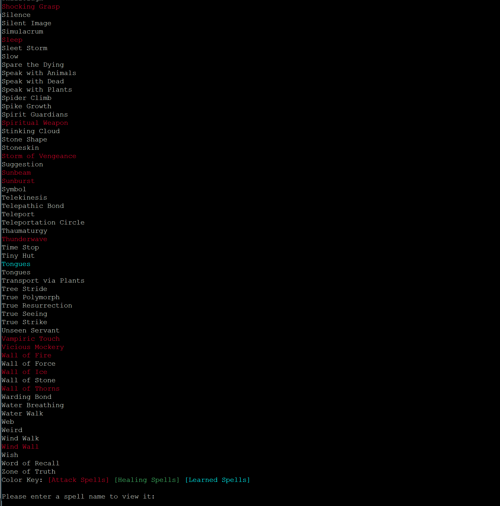

## Updating Your README.md

`README.md` is a Markdown file that describes your project. These files can be
used in many different ways- you may have noticed that we use them to generate
entire Canvas lessons- but they're most commonly used as homepages for online
Git repositories. **When you develop something that you want other people to
use, you need to have a README.**

Markdown is not a language that we cover in Flatiron's Software Engineering
curriculum, but it's not a particularly difficult language to learn (if you've
ever left a comment on Reddit, you might already know the basics). Refer to the
cheat sheet in this lesson's resources for a basic guide to Markdown.

### What Goes into a README?

This README should serve as a template for your own- go through the important
files in your project and describe what they do. Each file that you edit
(you can ignore your Alembic files) should get at least a paragraph. Each
function should get a small blurb.

You should descibe your actual CLI script first, and with a good level of
detail. The rest should be ordered by importance to the user. (Probably
functions next, then models.)

Screenshots and links to resources that you used throughout are also useful to
users and collaborators, but a little more syntactically complicated. Only add
these in if you're feeling comfortable with Markdown.

***

## Conclusion

A lot of work goes into a good CLI, but it all relies on concepts that you've
practiced quite a bit by now. Hopefully this template and guide will get you
off to a good start with your Phase 3 Project.

Happy coding!

***

## Resources

- [Setting up a respository - Atlassian](https://www.atlassian.com/git/tutorials/setting-up-a-repository)
- [Create a repo- GitHub Docs](https://docs.github.com/en/get-started/quickstart/create-a-repo)
- [Markdown Cheat Sheet](https://www.markdownguide.org/cheat-sheet/)

# Spellbook

## Description

Spellbook is a vital resource for all spellcasters in Dungeons and Dragons
fifth edition. Just as its name suggests, Spellbook utilizes a series of
databases to store a user's characters, and further, it keeps track of all
spells that character has learned throughout their campaign. The application
also allows the user to filter spells by class, casting level, school, and even
attack and healing spells. Pulling spells from the [D&D 5e API](https://www.dnd5eapi.co/), 
you can always be sure that the spell database is going to be filled with the
most up-to-date and accurate information.

## Table of Contents
- [Installation](#installation)
- [Usage](#Uuage)
    - [Creating an Account](#creating-an-account)
    - [Creating a Character](#creating-a-character)
- [Features](#features)
- [Screenshots](#screenshots)
- [Credits](#credits)
- [Contact](#contact)
- [Acknowledgements](#acknowledgements)

## Installation

- Clone this repository down to your local environment.
- Open the cloned directory and run `pipenv install` to install dependencies.
- Once dependencies are installed, run `pipenv shell` to open your virtual environment.
- Seeding databases
    - Run `alembic upgrade head` to instantiate your databases
    - cd into the db folder: `cd lib/db`
    - Run `python3 seed.py` to execute seed file and populate databases
- cd out of the db directory back into the lib folder
- Run `./cli.py` to open application

## Usage

<!-- Explain how to use the Spellbook App once it's installed.
Provide examples of common use cases.
Include command line instructions or screenshots if 
applicable.-->

On launch, you'll be presented with the Login screen for the app.

From here you can choose to Login or create a new account. You also have the option to view or filter the spell list for quick access from here if you'd like.

### Creating an Account

If you're reading this for the first time, you'll need to set up an account! Simply select "Create New Account" to get started, and enter your first name, last name, and desired username when prompted. Creating an account will automatically log you in to your character selection page. Now you can create your first character! 

### Creating a Character

Creating a character is a similar process to creating an account. Select "Create New Character" to proceed. You'll be prompted to enter your character's full name, level, and class. Doing so successfully will take you to that character's page:

From here you have a variety of options from which to choose. Now that we're logged in as Johnny Appleseed, we can go to any of the spell lists, filtered or otherwise, and easily add and remove spells to and from Johnny's spellbook.

---

## Features

- **Character Management**: Easily create and manage characters, specifying their names, levels, and classes.
- **Spell Tracking**: Keep track of the spells your characters have learned, complete with spell details.
- **Filtering and Sorting**: Filter spells by class, casting level, school, and type (attack or healing).
- **Dynamic Progress**: Utilize a dynamic progress bar during seeding and other data-intensive operations.

## Screenshots

## Credits
### External Libraries Used
- [Simple Terminal Menu](https://pypi.org/project/simple-term-menu/)
- [alive-progress](https://github.com/rsalmei/alive-progress#readme)
- [art](https://pypi.org/project/art/)
- [prettycli](https://github.com/noyoshi/prettycli)
- [Faker](https://faker.readthedocs.io/en/master/)
- [Fantasy Name Generator](https://pypi.org/project/fantasynames/)
- [Requests](https://pypi.org/project/requests/)

Spell Data gathered from the [D&D 5th Edition API](https://www.dnd5eapi.co/)

## Contact

Feel free to reach out to me on [github](https://github.com/shroobear) with any questions, comments, or concerns!

## Contributing

Contributions are welcome! If you have suggestions or find issues, please open an issue or pull request.

## License

This project is licensed under the [MIT License](https://opensource.org/license/mit/)
