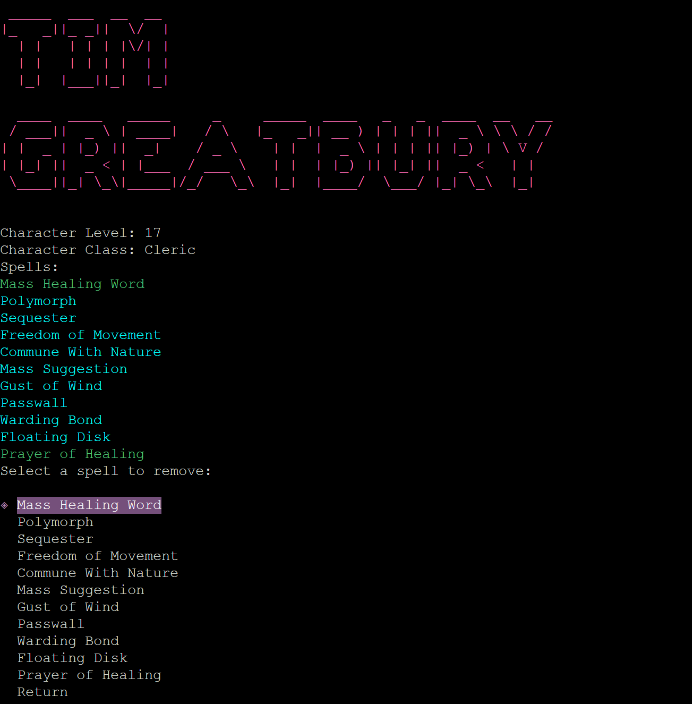

# Spellbook

## Description

Spellbook is a vital resource for all spellcasters in Dungeons and Dragons fifth edition. Just as its name suggests, Spellbook utilizes a series of databases to store a user's characters, and further, it keeps track of all
spells that character has learned throughout their campaign. The application also allows the user to filter spells by class, casting level, school, and even attack and healing spells. Pulling spells from the [D&D 5e API](https://www.dnd5eapi.co/), you can always be sure that the spell database is going to be filled with the most up-to-date and accurate information.

## Table of Contents
- [Installation](#installation)
- [Usage](#Uuage)
    - [Creating an Account](#creating-an-account)
    - [Creating a Character](#creating-a-character)
    - [Viewing Spells](#viewing-spells)
    - [Filtering Spells](#filtering-spells)
    - [Editing Spells](#editing-spells)
- [Features](#features)
- [Screenshots](#screenshots)
- [Credits](#credits)
- [Contact](#contact)
- [Contributing](#contributing)
- [License](#license)

## Installation

- Clone this repository down to your local environment.
- Open the cloned directory and run `pipenv install` to install dependencies.
- Once dependencies are installed, run `pipenv shell` to open your virtual environment.
- Seeding databases
    - Run the following commands:
        ```
        alembic upgrade head    # Instantiates databases
        cd lib/db
        python3 seed.py         # Populates databases
        ```
- cd out of the db directory back into the lib folder
- Run `./cli.py` to open application

## Usage

On launch, you'll be presented with the Login screen for the app.


From here you can choose to Login or create a new account. You also have the option to view or filter the spell list for quick access from here if you'd like.

### Creating an Account

If you're reading this for the first time, you'll need to set up an account! Simply select "Create New Account" to get started, and enter your first name, last name, and desired username when prompted. Creating an account will automatically log you in to your character selection page. Now you can create your first character! 

### Creating a Character

Creating a character is a similar process to creating an account. Select "Create New Character" to proceed. You'll be prompted to enter your character's full name, level, and class. Doing so successfully will take you to that character's page:


From here you have a variety of options from which to choose. Now that we're logged in as Johnny Appleseed, we can go to any of the spell lists, filtered or otherwise, and easily add and remove spells to and from Johnny's spellbook.

### Viewing Spells
Spells can be viewed a number of different ways, and they are color-coded accordingly:
| Color | Description |
| :---: | :---: |
| Red | Attack Spells |
| Green | Healing Spells |
| Cyan | Spells Learned by the current Character |


This can be useful when browsing the list and looking for a new spell to learn, but the Master List can be pretty overwhelming. This is where the Filter Spells menu comes in handy!

### Filtering Spells

You can access the Spell Filters just as easily as the master spell list. When you select the "Filter Spells" menu option, you'll be provided with the following filters:


Selecting any of these will help narrow down your search a little bit. 

### Editing Spells

Perhaps you accidentally added a spell you didn't want to, or your learned spells have changed upon leveling up. No worries, there is a way to reflect these changes! Within any character's page is an option to "Edit Spells", which will open a prompt for you to easily select which spell to unlearn.




---

## Features

- **Character Management**: Easily create and manage characters, specifying their names, levels, and classes.
- **Spell Tracking**: Keep track of the spells your characters have learned, complete with spell details.
- **Filtering and Sorting**: Filter spells by class, casting level, school, and type (attack or healing).
- **Dynamic Progress**: Utilize a dynamic progress bar during seeding and other data-intensive operations.

## Screenshots


## Credits
### External Libraries Used
- [Simple Terminal Menu](https://pypi.org/project/simple-term-menu/)
- [alive-progress](https://github.com/rsalmei/alive-progress#readme)
- [art](https://pypi.org/project/art/)
- [prettycli](https://github.com/noyoshi/prettycli)
- [Faker](https://faker.readthedocs.io/en/master/)
- [Fantasy Name Generator](https://pypi.org/project/fantasynames/)
- [Requests](https://pypi.org/project/requests/)

Spell Data gathered from the [D&D 5th Edition API](https://www.dnd5eapi.co/)

## Contact

Feel free to reach out to me on [github](https://github.com/shroobear) with any questions, comments, or concerns!

## Contributing

Contributions are welcome! If you have suggestions or find issues, please open an issue or pull request.

## License

This project is licensed under the [MIT License](https://opensource.org/license/mit/)

---
Thanks for checking out my application!

